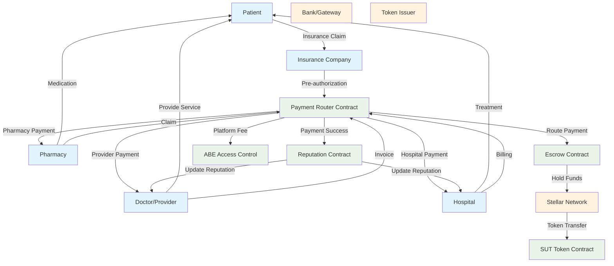
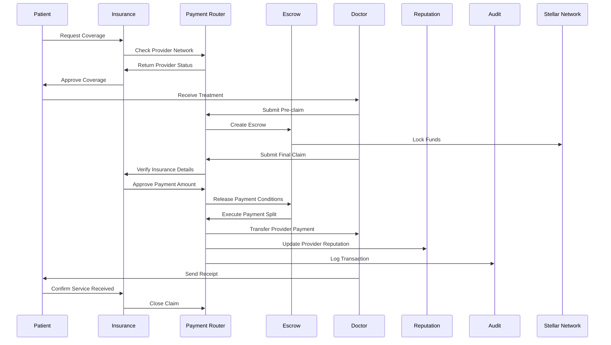
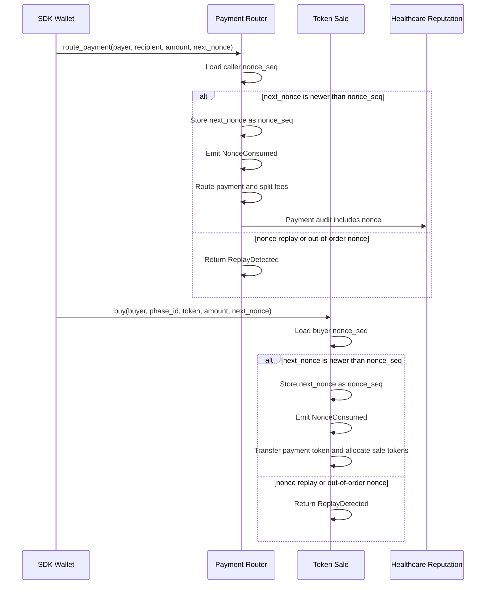
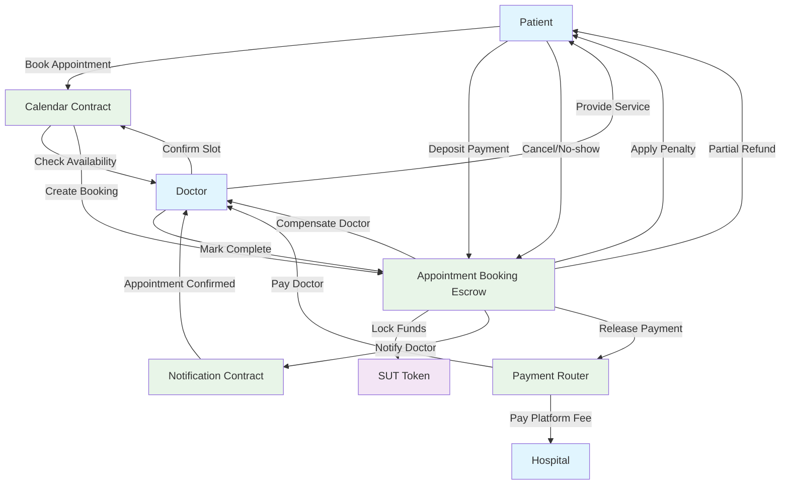
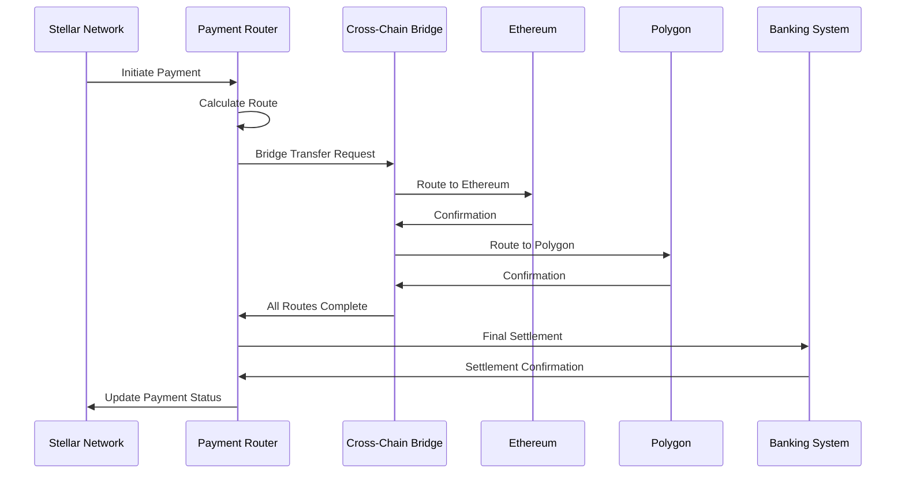
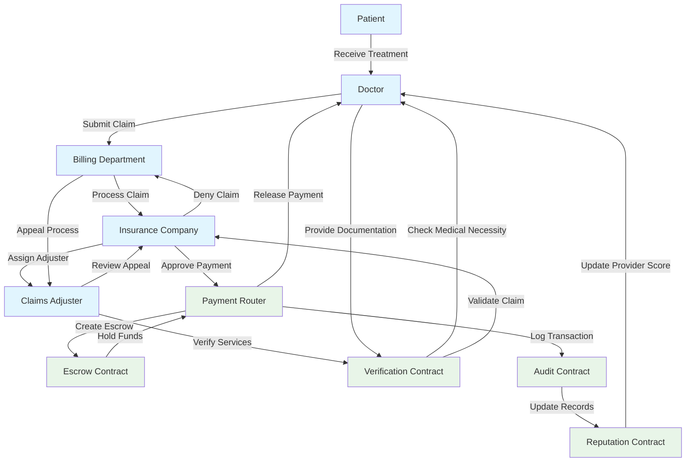
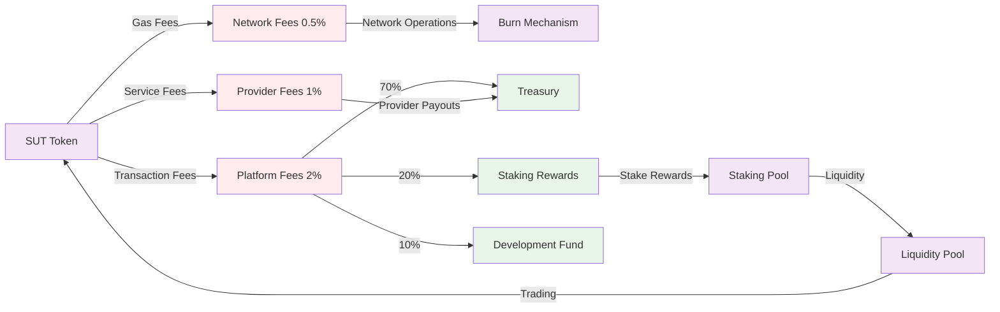
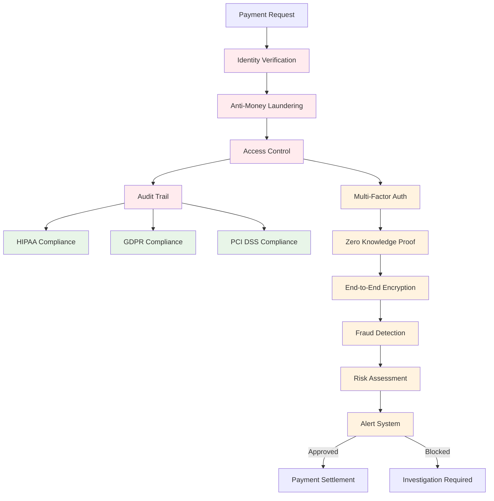
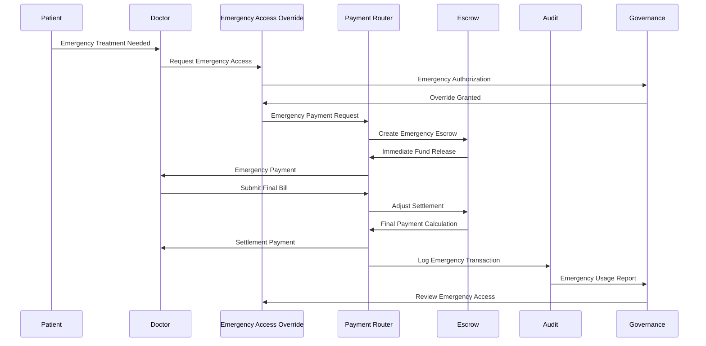

# Payment Flow Diagrams

## Healthcare Payment Processing Flow

## Detailed Payment Transaction Flow

## Replay Protection for Payment Mutations

## Escrow-Based Appointment Booking Flow

## Cross-Chain Payment Settlement Flow

## Insurance Claim Processing Flow

## Token Economics and Fee Structure

## Payment Security and Compliance Flow

## Emergency Payment Override Flow

## Key Payment Features

### **1. Multi-Token Support**
- **SUT Token**: Platform native token
- **Stablecoins**: USDC, USDT for price stability
- **Traditional**: Integration with banking systems

### **2. Smart Escrow System**
- **Conditional Release**: Based on service completion
- **Dispute Resolution**: Automated dispute handling
- **Refund Protection**: Patient and provider safeguards

### **3. Insurance Integration**
- **Pre-authorization**: Coverage verification
- **Claims Processing**: Automated claim handling
- **Coordination of Benefits**: Multiple insurer support

### **4. Cross-Chain Compatibility**
- **Multi-chain Routing**: Optimized payment paths
- **Bridge Integration**: Seamless cross-chain transfers
- **Liquidity Management**: Efficient fund allocation

### **5. Compliance & Security**
- **HIPAA Compliant**: Healthcare data protection
- **AML/KYC**: Regulatory compliance
- **Audit Trails**: Complete transaction history

This payment system provides a comprehensive, secure, and efficient solution for healthcare financial transactions while maintaining regulatory compliance and user privacy.
